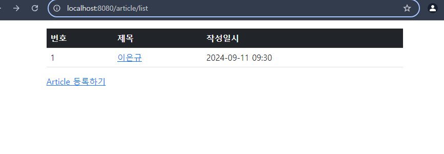
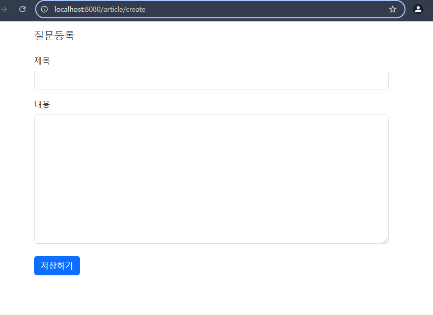

## 1차 요구사항 구현
- [O] 유저가 루트 url로 접속시에 게시글 리스트 페이지(http://주소:포트/article/list)가 나온다.
- [O] 리스트 페이지에서는 등록 버튼이 있고 버튼을 누르면 http://주소:포트/article/create 경로로 이동하고 등록 폼이 나온다.
- [ ] 게시글 등록을 하면 http://주소:포트/article/create로 POST 요청을 보내어 DB에 해당 내용을 저장한다.
- [ ] 게시글 등록이 되면 해당 게시글 리스트 페이지로 리다이렉트 된다. 페이지 URL 은 http://주소:포트/article/list 이다.
- [ ] 리스트 페이지에서 해당 게시글을 클릭하면 상세페이지로 이동한다. 해당 경로는 http://주소:포트/article/detail/{id} 가 된다.
- [O] 게시글 상세 페이지에는 id에 맞는 게시글 데이터와 목록 버튼이 있다. 목록 버튼을 누르면 게시글 리스트 페이지로 이동하게 된다.

- (추가 기능이나 구현기능설명이 필요한 경우 서술)

## 미비사항 or 막힌 부분
- class 파일이 너무 많아서 어디서 어떻게 코드가 짜지는지 헷갈립니다.
- html에서 상세 페이지를 만들때 @, $ , {} 등 코드 짜는 게 힘듭니다.

## UI/UX
- 게시글 리스트 페이지
- 
- 게시글 상세 페이지

## MVC 패턴
- ...dd

## 스프링에서 의존성 주입(DI) 방법 3가지 방법
- ...

## JPA의 장점과 단점
- 데이터베이스 관리 하기가 쉽습니다.

## HTTP GET 요청과 POST 요청의 차이
- ...